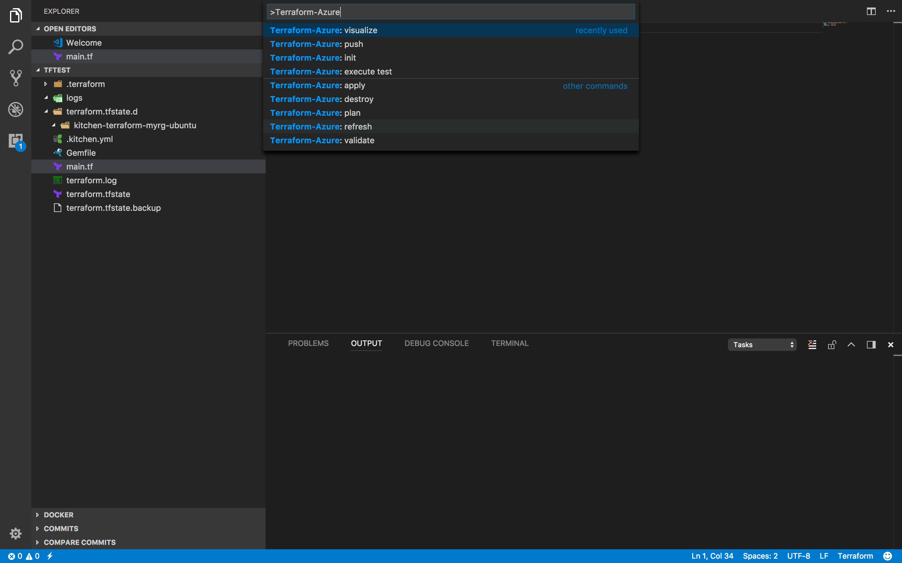
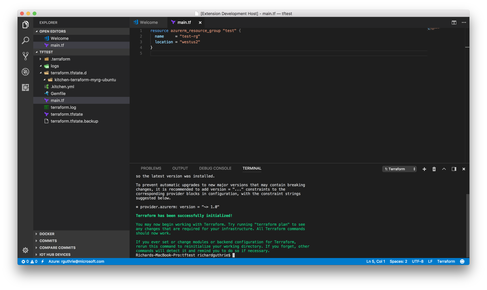
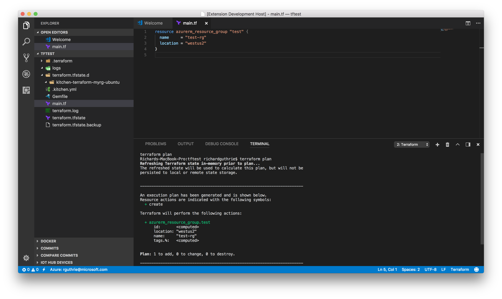

# vscode-terraform-azure README

The VSCode Terraform Azure extension is designed to increase developer productivity building Terraform modules for Azure.  The extension provides, linting, terraform command support, resource graph visualization, testing and cloudshell integration inside of VSCode.

## Features

The features in this extension support execution in integrated terminal mode or remotely using Azure CloudShell.  The exceptions to this are:
`Terraform Azure: visualize` and `Terraform Azure: execute test` always run locally.  `Terraform-Azure: push` only executes in cloud shell mode as this feature syncs your workspace with your cloudshell env.

This extension supports the following features:

### Terraform Azure: init

Executes `terraform init` command against project workspace.  If run with terminal set to cloudshell, will run `terraform init` in cloudshell.

### Terraform Azure: plan

Executes `terraform plan` command against project workspace.  If run with terminal set to cloudshell, will run `terraform plan` in cloudshell.

### Terraform Azure: apply

### Terraform Azure: validate

### Terraform Azure: refresh

### Terraform Azure: destroy

### Terraform Azure: visualize

### Terraform Azure: execute test

### Terraform Azure: push

This command will sync workspace files that meet filter `tf-azure.files` setting in your configuration to Azure - Cloudshell.

## Requirements

This extension requires:

* [Terraform](https://www.terraform.io/downloads.html)
* [Docker](http://www.docker.io) if you are using the execute test feature.
* [GraphViz dot](http://www.graphviz.org) if you are using the visualize feature.  
  * NOTE: On Windows after installing the graphViz msi/zip, you will most likely need to add your PATH env variable `(Ex. c:\Program Files(x86)\GraphViz2.38\bin)` in order to use dot from the command line.

## Supported Environments

* [Microsoft Azure](https://azure.microsoft.com)

## Extension Settings

* `tf-azure` - Parent for Terraform-Azure related extension settings
  * `tf-azure.terminal` - Specifies terminal used to run Terraform commands. Valid settings are `cloudshell` or `integrated`
  * `tf-azure.files` - Indicates the files that should be synchronized to Azure cloudshell using the glob pattern string, for example `**/*.{tf,txt}`

## Known Issues

Windows support for dot has some unhandled exception cases.  We are working to improve this area.

## Release Notes

### 1.0.0

Initial release of vscode-terraform-azure extension.

-----------------------------------------------------------------------------------------------------------

## Working with Markdown

**Note:** You can author your README using Visual Studio Code.  Here are some useful editor keyboard shortcuts:

* Split the editor (`Cmd+\` on OSX or `Ctrl+\` on Windows and Linux)
* Toggle preview (`Shift+CMD+V` on OSX or `Shift+Ctrl+V` on Windows and Linux)
* Press `Ctrl+Space` (Windows, Linux) or `Cmd+Space` (OSX) to see a list of Markdown snippets

### For more information

* [Visual Studio Code's Markdown Support](http://code.visualstudio.com/docs/languages/markdown)
* [Markdown Syntax Reference](https://help.github.com/articles/markdown-basics/)

**Enjoy!**