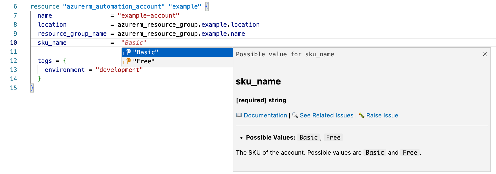
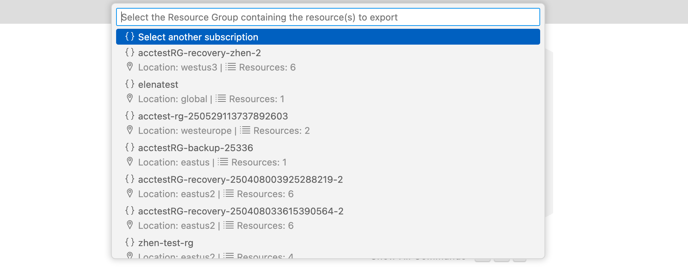
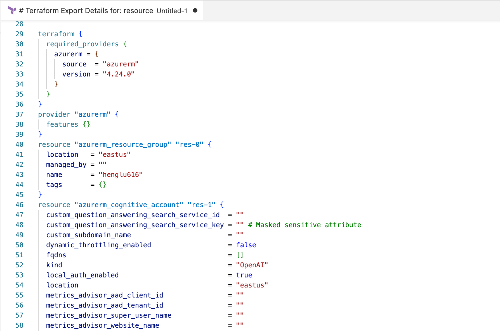
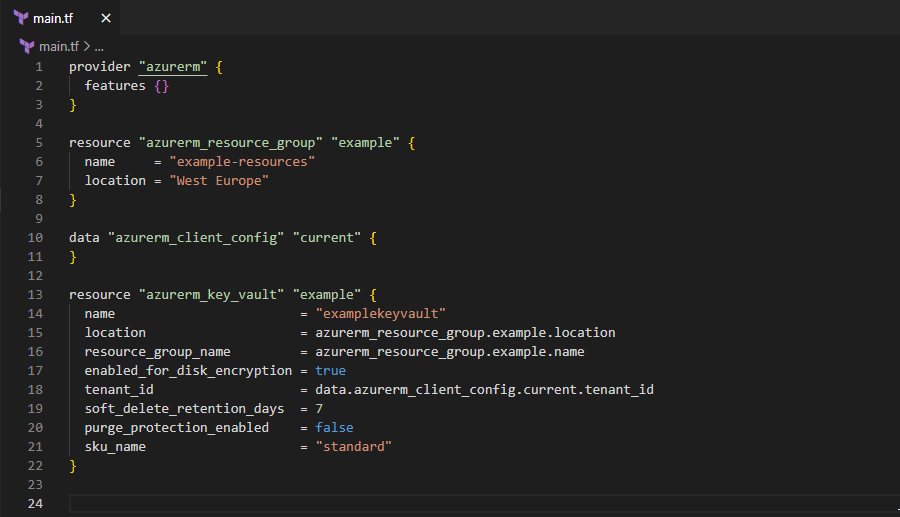
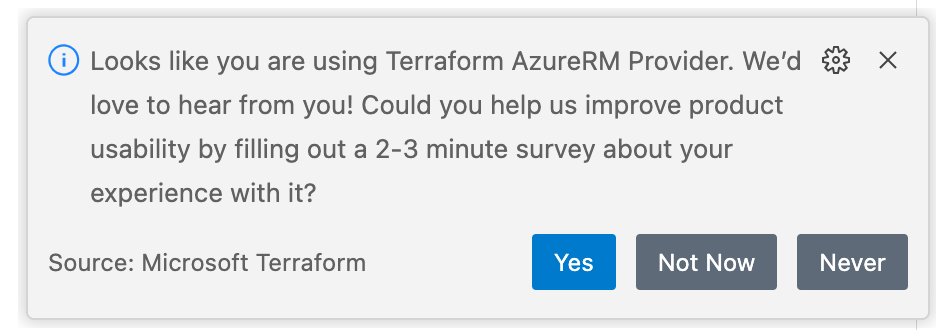

# Microsoft Terraform

The VSCode Microsoft Terraform extension is designed to increase developer productivity authoring, testing and using Terraform with Azure. The extension provides terraform command support and resource graph visualization.

## Important Note
⚠️ **CloudShell integration is currently unavailable** in this version of the extension. All Terraform commands will run in your local integrated terminal.

## Requirements

This extension requires:

- [Terraform](https://www.terraform.io/downloads.html) - Required for executing terraform commands
- [GraphViz](http://www.graphviz.org) - Required for the visualize feature

> NOTE: Please make sure these requirements are in your PATH environment variable.

## Features

This extension supports the following features:

- Terraform commands: init, plan, apply, validate, refresh and destroy
- Visualize the terraform module
- Suggest resources, properties, and values for those properties
- On-hover documentation
- Ingtegration with [Azure Export for Terraform](https://learn.microsoft.com/en-us/azure/developer/terraform/azure-export-for-terraform/export-terraform-overview) to Export Azure Resources As Terraform Blocks
- Integrated survey for user feedback

## Guides

This extension provides the following guides to help you get started:

### Language features

1. Input `azurerm_` in a `.tf` file to see example suggestions for `azurerm` resources.

2. Hover over an `azurerm` resource or property to see its documentation.

3. It provides value suggestions for properties of `azurerm` resources. For example, if you type `sku_name = `, it will suggest available values for the `sku_name` property of the `azurerm_automation_account` resource.

### Export Azure Resources As Terraform

This feature allows you to export existing Azure resources as Terraform configuration blocks using Azure Export for Terraform. This helps you migrate existing Azure resources to Terraform-managed infrastructure.

1. Open the Command Palette (`Command`+`Shift`+`P` on macOS and `Ctrl`+`Shift`+`P` on Windows/Linux).

2. Search for and select the command `Microsoft Terraform: Export Azure Resource as Terraform`.

3. Follow the prompts to select the Azure subscription and resource group containing the resources you want to export.

4. Select the `azurerm` provider or the `azapi` provider to export the resources.

5. The extension will generate the Terraform configuration blocks for the selected resources and display them in a new editor tab.

### Generate Required Permissions

This feature help you generate the required permissions for AzureRM resources in Terraform configuration.

Select some `azurerm` resources in your `.tf` file, then you can see a lightbulb icon appear next to the selected resources. Click on the lightbulb icon to see the option to generate required permissions. After clicking, the extension will generate the required permissions and display them in a new editor tab.

This feature also supports generating the missing permissions for the selected resources. Please ensure that you have logged in to Azure using the `az login` command before using this feature.

A step-by-step guide can be found [here](https://github.com/Azure/ms-terraform-lsp/blob/main/docs/genearte_required_permissions_guide.md).

### Survey

We value your feedback! You can share your experience with the Microsoft Terraform extension by running the command `Microsoft Terraform: Show Survey` from the Command Palette. Your input helps us improve the extension and better serve your needs.

## Commands

Open the Command Palette (`Command`+`Shift`+`P` on macOS and `Ctrl`+`Shift`+`P` on Windows/Linux) and type in one of the following commands:

<table>
  <thead>
  <tr>
    <th>Command</th>
    <th>Description</th>
  </tr>
  </thead>
  <tbody>
  <tr>
    <td width="35%">
      Basic commands: 
      <ul>
        <li>Microsoft Terraform: init</li>
        <li>Microsoft Terraform: plan</li>
        <li>Microsoft Terraform: apply</li>
        <li>Microsoft Terraform: validate</li>
        <li>Microsoft Terraform: refresh</li>
        <li>Microsoft Terraform: destroy</li>
      </ul>
    </td>
    <td>
      Execute terraform command against the current project workspace.
        
      <em>Note: All commands run in your local integrated terminal.</em>
    </td>
  </tr>
  <tr>
    <td>Microsoft Terraform: visualize</td>
    <td>Create a visual representation of the components of the module and save it in <code>graph.png</code>.</td>
  </tr>
  <tr>
    <td>Microsoft Terraform: Execute Test</td>
    <td>
      Run one of the following test against the current module using a test container:  
      <ul>
        <li>lint: This command will check the formating of the code of the Terraform module.</li>
        <li>e2e: This command will deploy the current module with the settings specified in the .tfvars file, verify that the deployment pass the controls and destroy the resources that have been created.</li>
      </ul>
    </td>
  </tr>
  <tr>
    <td>Microsoft Terraform: Export Azure Resource as Terraform</td>
    <td>Export existing Azure resources as Terraform configuration blocks using Azure Export for Terraform. This helps you migrate existing Azure resources to Terraform-managed infrastructure.</td>
  </tr>
  <tr>
    <td>Microsoft Terraform: Show Survey</td>
    <td>Open the feedback survey to share your experience and help us improve.</td>
  </tr>
  </tbody>
</table>

## Extension Settings

- `azureTerraform.terminal` - Specifies terminal used to run Terraform commands. Currently only `integrated` terminal is supported.
- `azureTerraform.test.imageName` - Indicates the container to use to run the tests. By default: `microsoft/terraform-test`.
- `azureTerraform.test.aciName` - Indicates the name of the Azure Container Instance to use for testing. By default: `tf-test-aci`.
- `azureTerraform.test.aciResourceGroup` - Indicates the name of the Resource Group to use for the ACI instance. By default: `tfTestResourceGroup`.
- `azureTerraform.aciContainerGroup` - Indicates the name of the Container Group that host the ACI instance. By default: `tfTestContainerGroup`
- `azureTerraform.test.location` - Indicates the location where to deploy the test container instance. By default: `westus`.

## Release Notes

Refer to [CHANGELOG](CHANGELOG.md)

## Telemetry
VS Code collects usage data and sends it to Microsoft to help improve our products and services. Read our [privacy statement](https://go.microsoft.com/fwlink/?LinkID=528096&clcid=0x409) to learn more. If you would like to opt out of sending telemetry data to Microsoft, update the `telemetry.enableTelemetry` setting to `false` in the **File** -> **Preferences** -> **Settings**. Read our [FAQ](https://code.visualstudio.com/docs/supporting/faq#_how-to-disable-telemetry-reporting) to learn more.

## License
[MIT](LICENSE.md)
