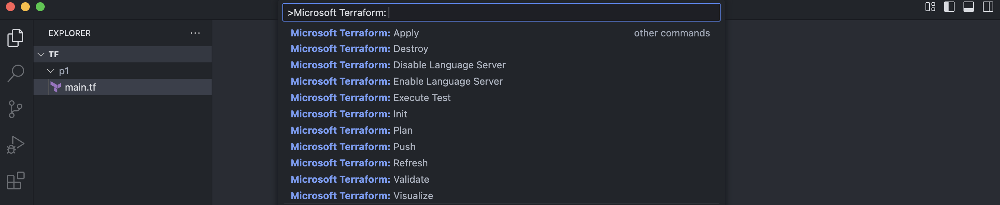

# Azure Terraform

The VSCode Azure Terraform extension is designed to increase developer productivity authoring, testing and using Terraform with Azure. The extension provides terraform command support, resource graph visualization and CloudShell integration inside VSCode.

## Features

The features in this extension support execution in integrated terminal mode or remotely using Azure CloudShell and Azure Container Instance. Some features only run locally at this time and will require some local dependencies.

This extension supports the following features:

- Terraform commands: init, plan, apply, validate, refresh and destroy.
- Visualize the terraform module.

### Azure Terraform: init

Executes `terraform init` command against the current project workspace.  If run with terminal set to CloudShell, will run `terraform init` in CloudShell.

### Azure Terraform: plan

Executes `terraform plan` command against the current project workspace.  If run with terminal set to CloudShell, will run `terraform plan` in CloudShell.

### Azure Terraform: apply

Executes `terraform apply` command against the current project workspace. If run with terminal set to CloudShell, will run `terraform apply` in CloudShell.

### Azure Terraform: validate

Executes `terraform validate` command against the current project workspace. If run with terminal set to CloudShell, will run `terraform validate` in CloudShell.

### Azure Terraform: refresh

Executes `terraform refresh` command against the current project workspace. If run with terminal set to CloudShell, will run `terraform refresh` in CloudShell.

### Azure Terraform: destroy

Executes `terraform destroy` command against the current project workspace. If run with terminal set to CloudShell, will run `terraform destroy` in CloudShell.

### Azure Terraform: visualize

> NOTE: only runs locally.

Creates a visual representation of the components of the module and save it in `graph.png`. This command requires [GraphViz dot](http://www.graphviz.org) to be installed locally.

### Azure Terraform: push

This command will sync workspace files that meet the filter `azureTerraform.files` setting in your configuration to Azure clouddrive.

## Requirements

This extension requires:

- [Terraform](https://www.terraform.io/downloads.html)
- [Node.js 6.0+](https://nodejs.org) if you are using the CloudShell.
- [GraphViz dot](http://www.graphviz.org) if you are using the visualize feature.

> NOTE: On Windows after installing the graphViz msi/zip, you will most likely need to add your PATH env variable `(Ex. c:\Program Files(x86)\GraphViz2.38\bin)` in order to use dot from the command line.

## Supported Environments

- [Microsoft Azure](https://azure.microsoft.com)

## Extension Settings

- `azureTerraform.terminal` - Specifies terminal used to run Terraform commands. Valid settings are `cloudshell` or `integrated`
- `azureTerraform.files` - Indicates the files that should be synchronized to Azure CloudShell using the glob pattern string, for example `**/*.{tf,txt,yml,tfvars,rb}`

## Known Issues

- Windows support for dot has some unhandled exception cases.  We are working to improve this area.
- We do not support private registry. The test container has to be on docker hub at this time.

## Release Notes

Refer to [CHANGELOG](CHANGELOG.md)
